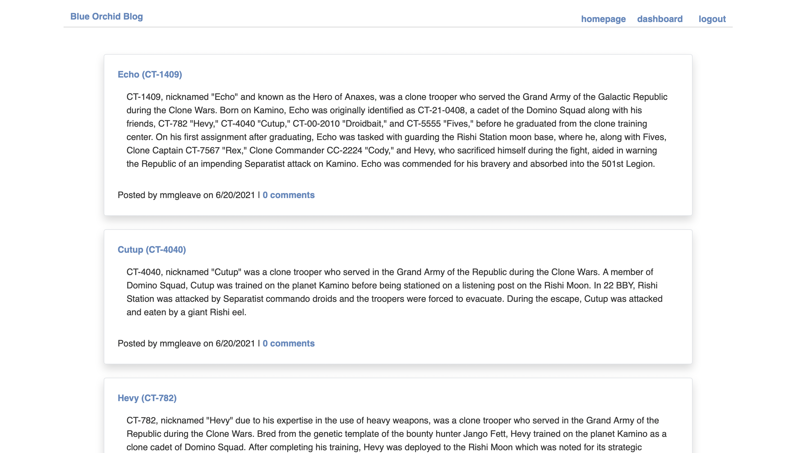
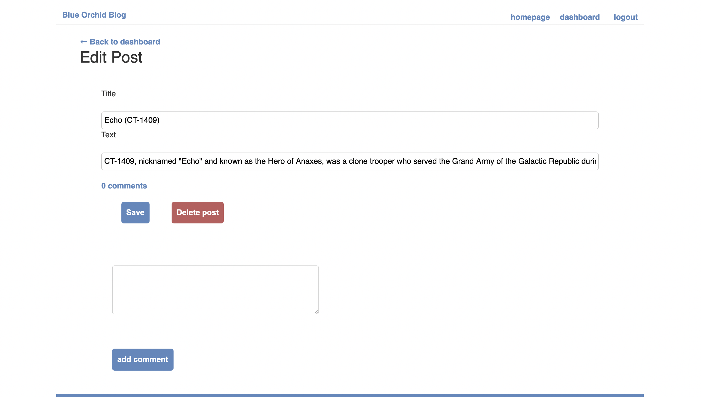
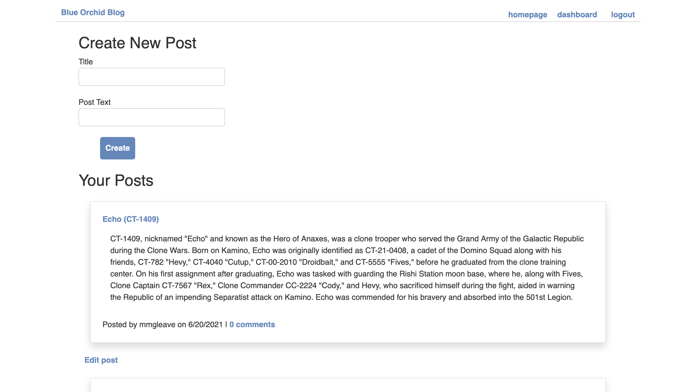
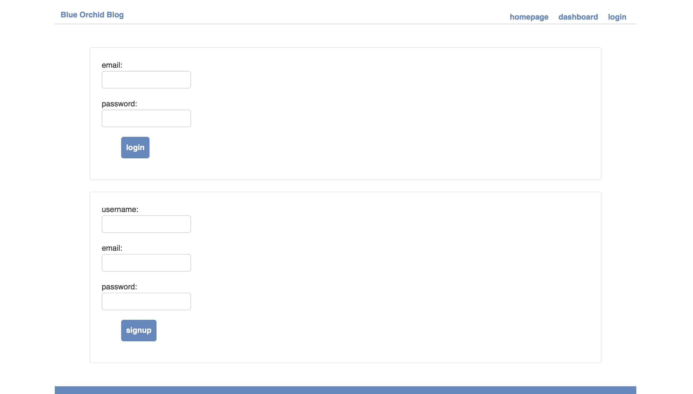

# Blue Orchid Blog
CMS-Style Blog Site

## Description
A generic but useful blog site template which allows the user to publish articles, blog posts, thoughts, and opinions. Users can create new blog posts, update or delete those posts, or comment on other uesr's posts.

## Screenshots

## Deployed Application (Heroku)
https://blue-orchid-blog.herokuapp.com 

## Questions
For questions, you can reach me on GitHub at http://github.com/mmgleave/ or via email at mmgleave@gmail.com.
